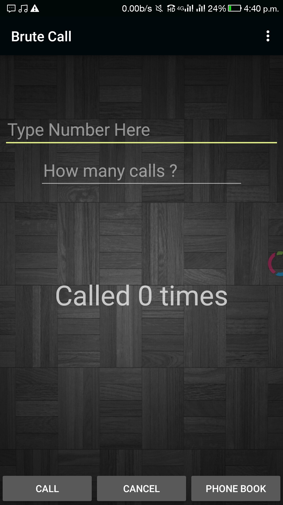

# BruteCall

<B>
You try to call someone  
But they dont pick up  
So you want to call them again and again till they pick up  
<h4> thats the app - Brute Call </h4>
</B>

  
Select the contact number from your contacts or type the number . give the number of times you want to call . Click Call . Done
  

<h5>Note </h5>
Android does not let you know whether the outgoing call was taken by the correspondant or whether it was rejected or rang out.
Therefore the app analysis the duration of ringing time to make this decision.
